# 影智云图库 ShadowWit-Gallery

上线地址：http://121.41.49.251/

## 项目介绍
基于 Vue3+Ant Design Vue+Pinia+Al+WebSocket 的 **图库平台**。

目前已完成功能：
1）所有用户都可以在平台公开上传和检索图片素材，快速找到需要的图片。可用作表情包网站、设计素材网站、壁纸网站等：
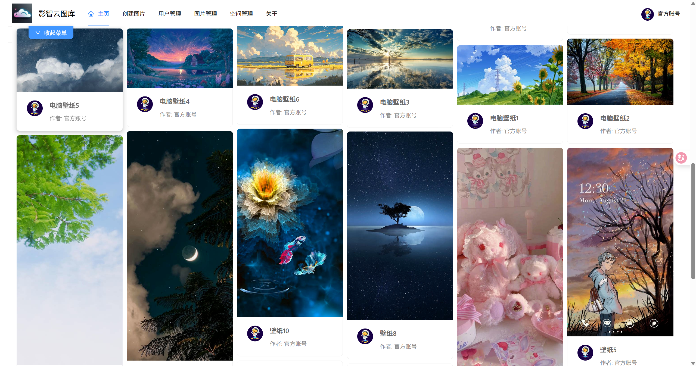

创建图片：

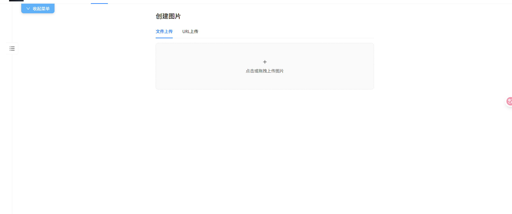

分享：

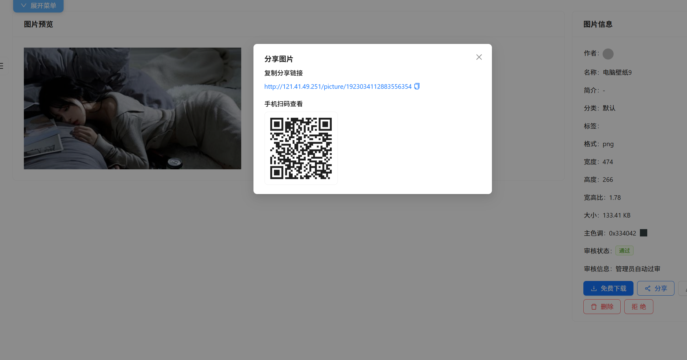

编辑图片：

AI扩图：

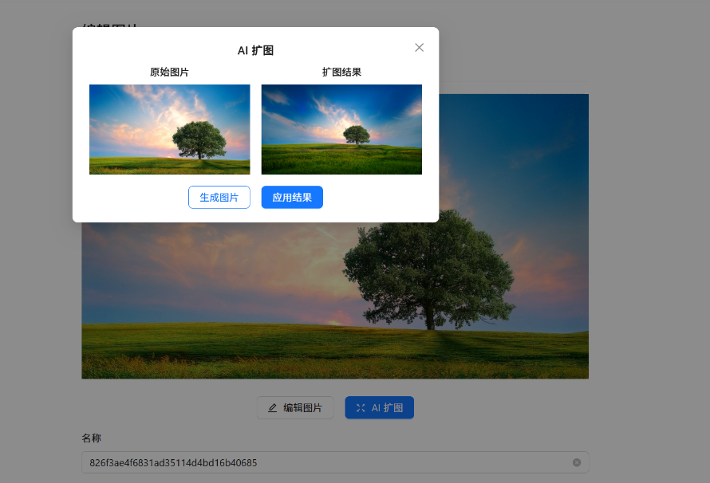

以图搜图:

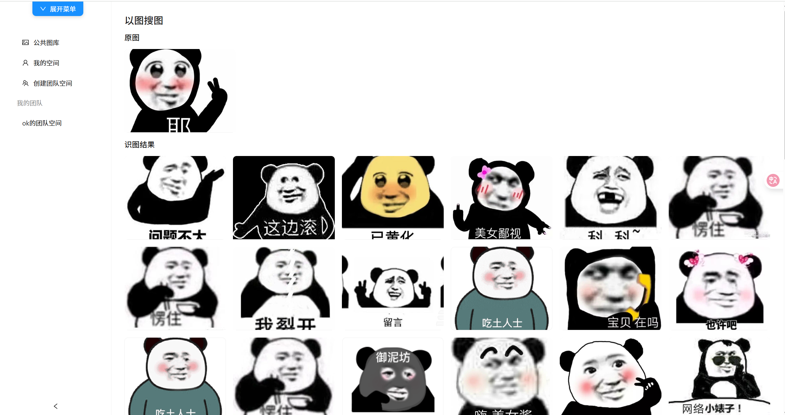

2）管理员可以上传、审核和管理图片，并对系统内的图片进行分析：

用户管理：

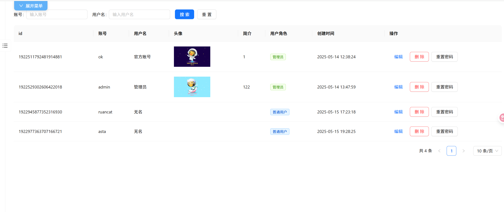

图片管理：
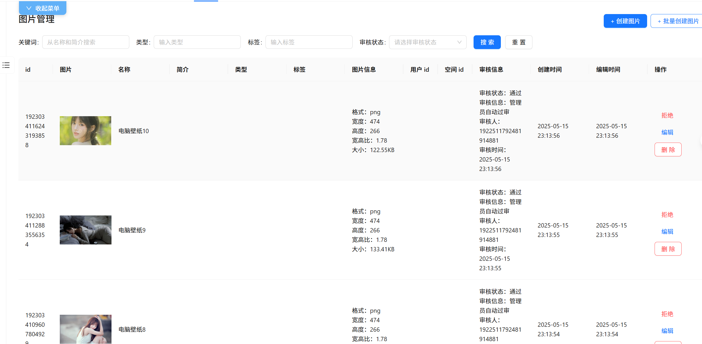

空间管理：

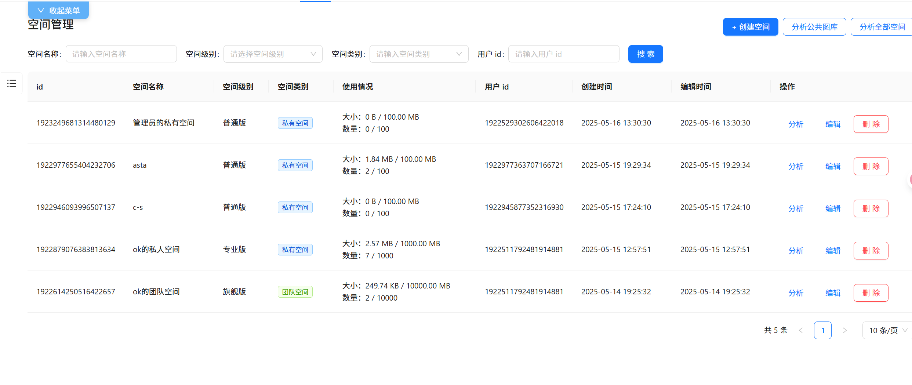

公共图库分析：

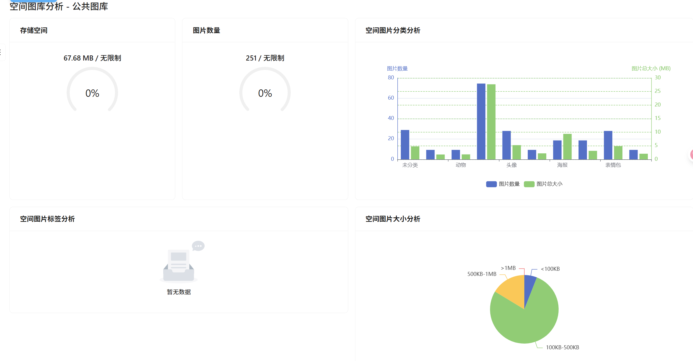

空间分析：

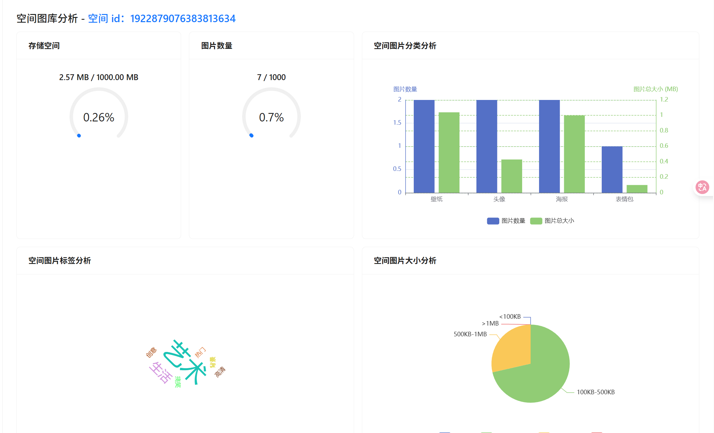

3）对于个人用户，可将图片上传至私有空间进行批量管理、检索、编辑和分析，可用作个人网盘、个人相册、作品集等：

搜索：

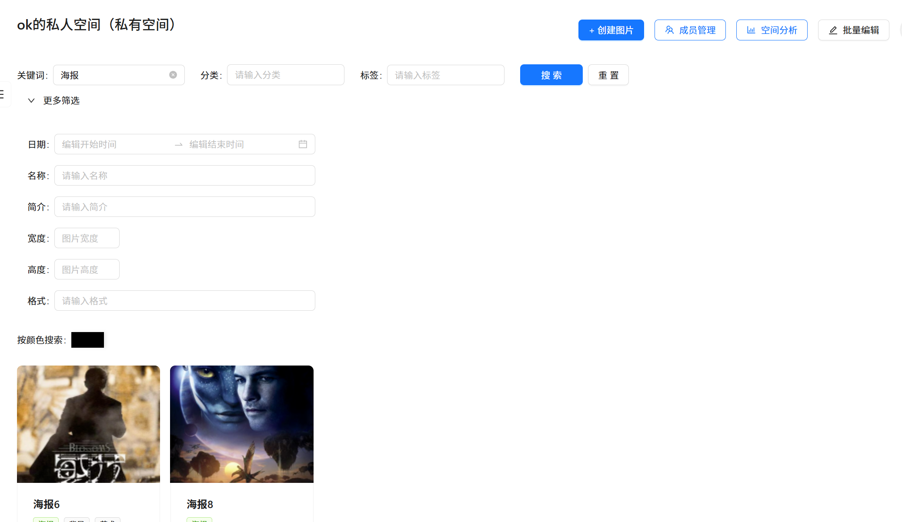

批量编辑：

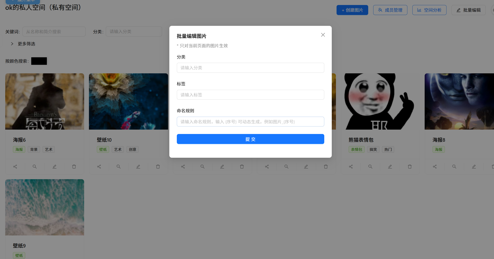

3）每个用户可以开通团队空间，邀请和管理空间成员，团队内共享图片并实时协同编辑图片。

管理团队成员：

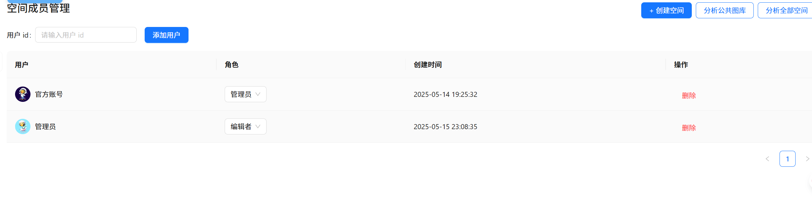

协同编辑：

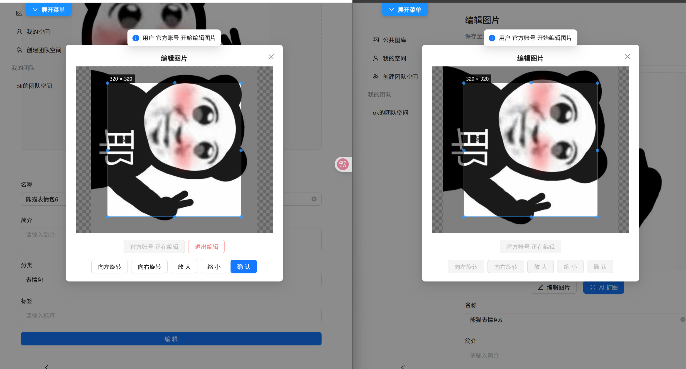

## 项目功能梳理：

#### 第一阶段：公共图库平台
用户模块 

+ 用户登录 
+ 用户注册 
+ 用户注销 
+ 修改密码
+ 用户权限控制 
+ 【管理员】管理用户
+ 【管理员】重置用户密码

图片模块 

+ 【管理员】上传创建图片
+ 【管理员】图片信息编辑（标签/分类等）
+ 【管理员】管理图片 
+  查看和搜索图片列表 
+ 查看图片详情（进入图片详情页）
+ 图片下载 
+ 用户上传创建图片 
+ 【管理员】审核图片 
+ 导入图片 
    - 通过 URL 导入图片 
    - 【管理员】批量抓取和创建图片
+ 【优化】图片查询优化- 分布式缓存、本地缓存、多级缓存 
+ 【优化】图片上传优化- 压缩、秒传、分片上传、断点续传 
+ 【优化】图片加载优化-懒加载、缩略图、CDN 加速、浏览器缓存 
+ 【优化】图片存储优化-降频存储（冷热数据分离）、清理策略

#### 第二阶段：用户私有图库
空间模块 

+ 【管理员】管理空间 
+ 用户开通私有空间 
+ 私有空间权限控制 
+ 空间级别和限额控制  
+ 空间图库分析 
    - 用户空间图库分析 
    - 【管理员】全空间分析

图片模块  

+ 图片搜索：基础属性搜索、以图搜图、颜色搜索 
+ 图片分享：链接分享、扫码分享 
+ 图片批量管理：批量修改信息、批量重命名 
+ 图片编辑：基础图片编辑、Al 图片编辑

## 目前项目架构设计图：

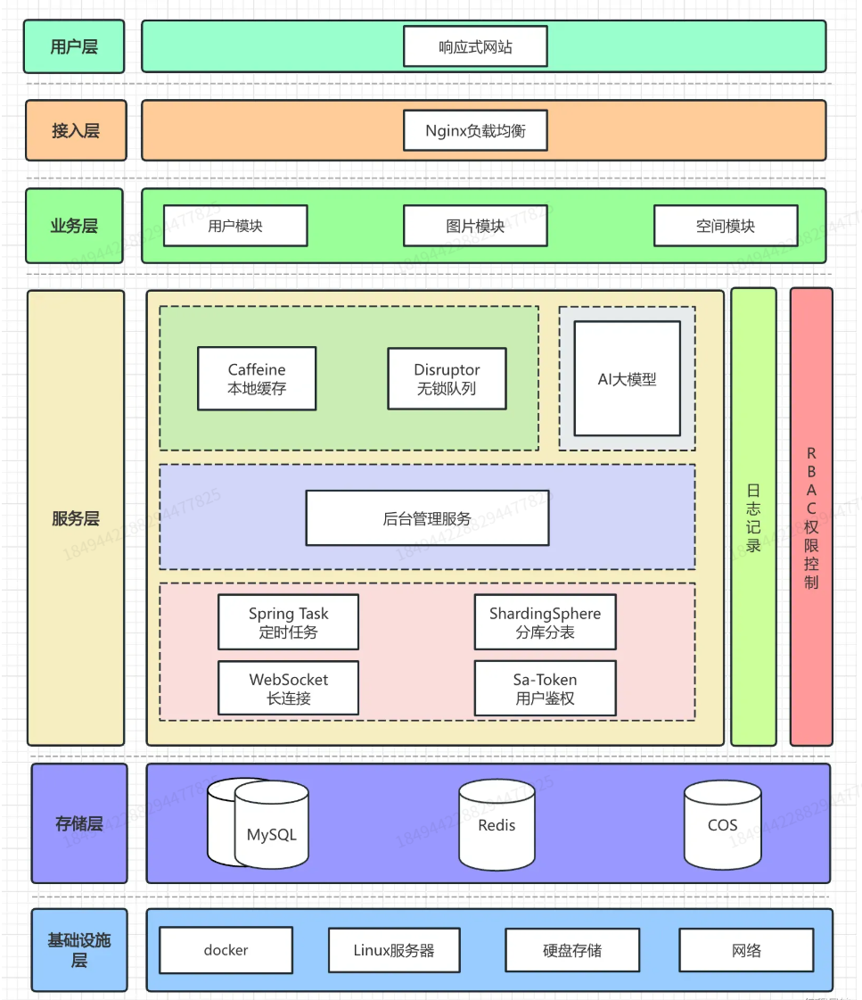

##  技术选型

### 后端

- Java Spring Boot 框架
- MySQL 数据库 + MyBatis-Plus 框架 + MyBatis X
- Redis 分布式缓存 + Caffeine 本地缓存
- Jsoup 数据抓取
- COS 对象存储
-  ShardingSphere 分库分表
-  Sa-Token 权限控制
-  DDD 领域驱动设计
-  WebSocket 双向通信
-  Disruptor 高性能无锁队列
-  JUC 并发和异步编程
-  AI 绘图大模型接入
-  多种设计模式的运用
-  多角度项目优化：性能、成本、安全性等

### 前端

- Vue 3 框架
- Vite 打包工具
- Ant Design Vue 组件库
- Axios 请求库
- Pinia 全局状态管理
- 其他组件：数据可视化、图片编辑等
- 前端工程化：ESLint + Prettier + TypeScript
-  OpenAPI 前端代码生成
- vue-waterfall-plugin-next瀑布流插件实现首页图片瀑布流
