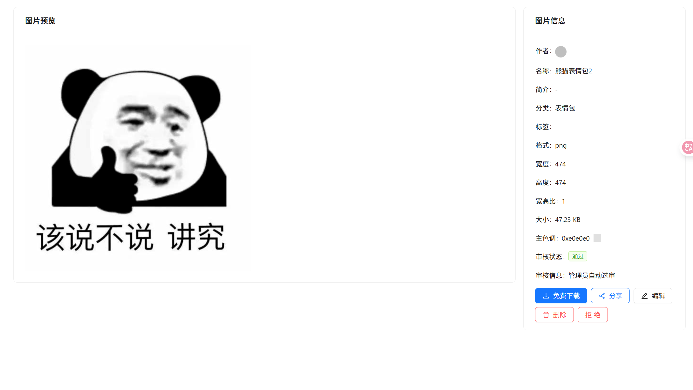

# 智能云图库

##  技术选型

### 后端

- Java Spring Boot 框架
- MySQL 数据库 + MyBatis-Plus 框架 + MyBatis X
- Redis 分布式缓存 + Caffeine 本地缓存
- Jsoup 数据抓取
- COS 对象存储
-  ShardingSphere 分库分表
-  Sa-Token 权限控制
-  DDD 领域驱动设计
-  WebSocket 双向通信
-  Disruptor 高性能无锁队列
-  JUC 并发和异步编程
-  AI 绘图大模型接入
-  多种设计模式的运用
-  多角度项目优化：性能、成本、安全性等

### 前端

- Vue 3 框架
- Vite 打包工具
- Ant Design Vue 组件库
- Axios 请求库
- Pinia 全局状态管理
- 其他组件：数据可视化、图片编辑等
- 前端工程化：ESLint + Prettier + TypeScript
-  OpenAPI 前端代码生成

## 网站图片

